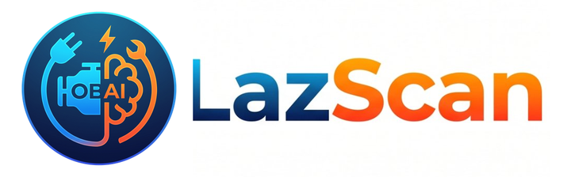

<p align="center"></p>

# LazScan

OBD-II diagnostics in an installable web app. Reads fault codes and live data from a Bluetooth LE adapter, explains them with AI (your own Groq key), checks NHTSA recalls and tracks parts with NFC tags. Single-file PWA, no build step, no app store. Part of [LAZLAB Creations](https://johnlaz.github.io/).

> **Status: beta.** The adapter engine (ELM327 init, VIN, fault codes, live PIDs) is implemented and has been verified end to end against a simulated ELM327 adapter. It has **not yet been tested on real cars and adapters**. Demo Mode runs the same engine against the simulated adapter and is always labelled as demo data.

## Live URLs

| | |
|---|---|
| Landing page | https://johnlaz.github.io/lazscan/ |
| App | https://johnlaz.github.io/lazscan/app/ |

## How it works

<p align="center"></p>

1. **Connect.** Web Bluetooth lists nearby devices; LazScan finds the adapter's serial characteristic automatically (FFF0, FFE0, 18F0 and a few vendor services).
2. **Initialise.** `ATZ`, `ATE0`, `ATL0`, `ATS0`, `ATH0`, `ATAT1`, `ATSP0`, then `0100` to wake the bus and read which PIDs the car supports.
3. **Read.** VIN (`0902`), MIL status (`0101`), codes (`03`, `07`, `0A`), then a polling loop over the supported live PIDs (RPM, speed, coolant, load, fuel trim, battery).
4. **Understand.** Codes get plain-English descriptions and severity. LazAI gets the vehicle, codes and live data as context.

## Features

- **Live vitals** with a rolling RPM / speed chart (drawn on canvas, no CDN dependency)
- **Fault codes**: stored, pending, permanent; severity; clear codes with confirmation
- **LazAI**: chat about your car, Groq model picker that loads the current model list from your key
- **Garage**: VIN decode, NHTSA recalls and complaint count, NFC component tags
- **Report**: print / save a PDF
- **Themes**: Garage Day (default), Midnight, Auto. Units: imperial or metric
- **PWA**: installable, offline app shell

## Repo layout

```
/index.html            landing page
/README.md
/docs/                 logo + README diagram
/app/index.html        the app (single file)
/app/manifest.json
/app/sw.js
/app/icon-192.png
/app/icon-512.png
/app/shot-scan.png     install screenshots (demo mode captures)
/app/shot-codes.png
/app/shot-desktop.png
/.nojekyll
```

## Hardware and browsers

| Adapter | Protocol |
|---|---|
| OBDLink CX | BLE |
| Vgate iCar Pro | BLE |
| vLinker MC+ | BLE |

Any BLE ELM327-style adapter that exposes a serial service should work. Classic Bluetooth (non-BLE) adapters will not. Chrome (Android, desktop), Edge (Windows), Bluefy (iPhone). On iPhone do **not** pair the adapter in system Bluetooth settings.

## AI / model setup

1. Create a free key at [console.groq.com](https://console.groq.com).
2. Paste it in **Settings → Save Key**. The model list is fetched from Groq and can be refreshed any time. Your selected model is never swapped automatically; if it disappears from Groq's list it is kept and flagged.
3. Default model: `llama-3.3-70b-versatile`.

## Data and privacy

Key, notes, tags, theme and saved vehicle live in `localStorage` on your device. There is no LAZLAB server. Network calls go only to Groq (AI), NHTSA (VIN decode, recalls, complaints). Demo data is never saved.

## Deploy / update

Pages: **Settings → Pages → Deploy from branch `main` / root**. After changing the app, bump `VERSION` in `app/index.html` **and** `CACHE_NAME` in `app/sw.js` together so installed copies update.

## Known limitations

- Not yet verified on real vehicles. Protocol quirks (older K-line / J1850 cars, clone adapters) may need fixes.
- Only generic OBD-II (SAE J1979) data. No manufacturer-specific modules (ABS, airbag, transmission).
- DTC descriptions cover ~116 common generic codes; others fall back to a generic label and LazAI.
- Web Bluetooth is not available in Safari on iPhone (use Bluefy).

## Changelog

| Version | Notes |
|---|---|
| v2.0.1 | Renamed to LazScan. New high-resolution icon and wordmark. |
| v2.0.0 | Rebuilt. Real ELM327 engine over Web Bluetooth (fixes the invalid short-UUID bug that always fell into demo mode). iOS-style interface. New brand palette from the new icon. Groq model picker. Chart.js removed. Demo Mode is explicit and labelled. New icons and screenshots. |
| v1.0.1 | Garage Day default theme, landing + `/app` layout, service worker fixes |
| v1.0.0 | Initial release (simulated data only) |

---

© 2026 LAZLAB Creations. All Rights Reserved. · lazlab.io@gmail.com
