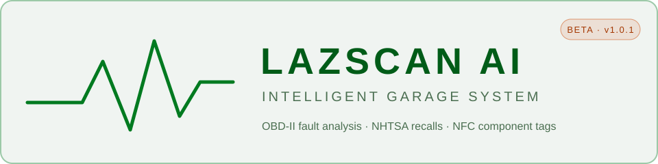
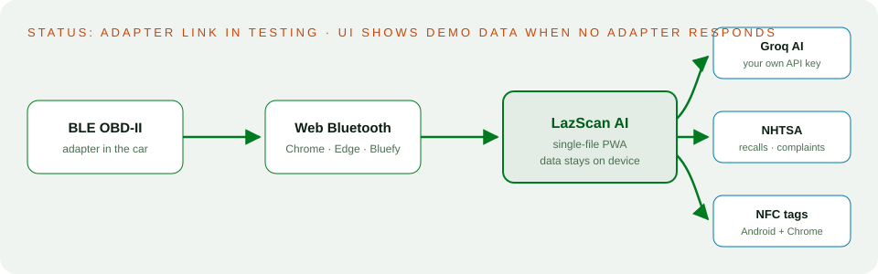

<p align="center"></p>

# LazScan AI

OBD-II diagnostics in an installable web app: AI analysis of fault codes, NHTSA recall lookup, NFC component tags and printable reports. Single-file PWA, no build step, no app store. Part of [LAZLAB Creations](https://johnlaz.github.io/).

> **Status: beta.** Recall lookup, Groq AI analysis, NFC tags, themes and reports work. The live link to the car's ECU (reading real codes and PIDs over BLE) is **not finished**: when no adapter responds, the dashboard shows demo data (sample vehicle, simulated gauges). See [Known limitations](#known-limitations).

## Live URLs

| | |
|---|---|
| Landing page | https://johnlaz.github.io/lazscan/ |
| App | https://johnlaz.github.io/lazscan/app/ |

## How it works

<p align="center"></p>

## Features

- **AI Cortex**: Groq-hosted model suggests likely causes and next steps for active codes (your own API key)
- **NHTSA**: open recalls and owner complaints for the decoded vehicle
- **NFC tags**: read and write component name, part number and install date (Android + Chrome)
- **Reports**: formatted diagnostic report via the browser's print / save as PDF
- **Dev Notes**: on-device idea / bug / feature log
- **Themes**: Garage Day (default), Diagnostic Green, Midnight Blue, Amber Forge
- **PWA**: installable, app shell cached for offline use

## Repo layout

```
/index.html            landing page
/README.md
/docs/                 README SVGs only
/app/index.html        the app (single file)
/app/manifest.json
/app/sw.js
/app/icon-192.png
/app/icon-512.png
/.nojekyll
```

## Hardware and browsers

| Adapter | Protocol |
|---|---|
| OBDLink CX | BLE |
| Vgate iCar Pro | BLE |
| vLinker MC+ | BLE |

Chrome (Android, Windows), Edge (Windows), Bluefy (iOS). On iOS do **not** pair the adapter in system Bluetooth settings.

## AI / model setup

1. Create a free key at [console.groq.com](https://console.groq.com).
2. Paste it in **Config**. It is stored in this browser's `localStorage` only and sent only to `api.groq.com`.
3. The model is currently hard-coded to `llama-3.3-70b-versatile`. A fetch-on-key-save model picker (as in the other LAZLAB apps) is planned.

## Data and privacy

Notes, theme and API key live in `localStorage`. There is no LAZLAB server. Network calls go to Groq (AI), NHTSA (vehicle, recalls, complaints), Google Fonts and jsDelivr (Chart.js).

## Deploy / update

Pages: **Settings → Pages → Deploy from branch `main` / root**. After changing the app, bump the version in **both** `VERSION` in `app/index.html` and `CACHE_NAME` in `app/sw.js` so installed copies update.

## Known limitations

- The app does not yet send ELM327 commands (`ATZ`, `ATE0`, `03`, `0100`…) or poll PIDs. Connecting does not read real data.
- VIN, vehicle, fault codes and gauges shown after "connecting" are demo values.

## Changelog

| Version | Notes |
|---|---|
| v1.0.1 | Garage Day default theme. Landing page at root, app moved to `/app/`. Service worker: network-first HTML, trimmed precache, versioned cache. Manifest: 192/512 icons, `id`, scope fixed. Chart.js pinned and its failure no longer breaks the app. Version badge tied to SW cache. README rewritten. |
| v1.0.0 | Initial release |

---

© 2026 LAZLAB Creations. All Rights Reserved. · lazlab.io@gmail.com
